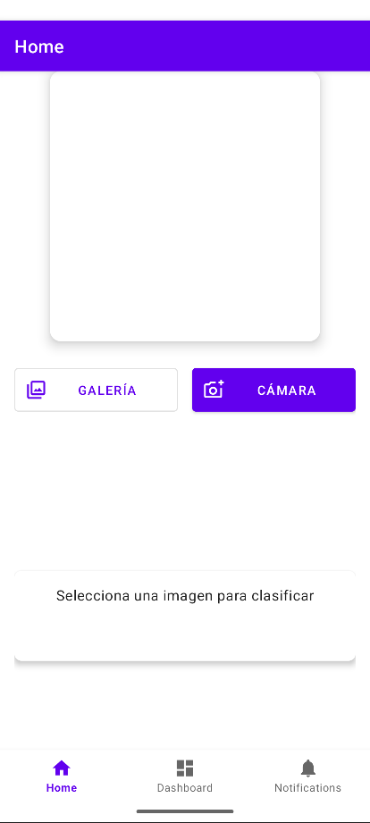

# 📱 Mobile-ML: Clasificador de Objetos con TensorFlow Lite en Android (Java)

¡Bienvenido a **Mobile-ML**! Esta es una aplicación Android desarrollada en Java que utiliza el poder de **TensorFlow Lite** para realizar clasificación de imágenes en tiempo real. La aplicación permite a los usuarios seleccionar imágenes de su galería o tomar fotos con la cámara para identificar objetos comunes de escritorio.

[](https://github.com/Jeremitc/Mobile-ML)
[-orange.svg)](https://www.java.com)
[](https://www.tensorflow.org/lite)
[](LICENSE)

## 🌟 Características Principales

*   **Clasificación de Imágenes:** Identifica objetos utilizando un modelo pre-entrenado de TensorFlow Lite.
    *   Actualmente configurado para reconocer: `lapiceros`, `cuadernos`, `ganchos` (y otros objetos según el archivo `labels.txt`).
*   **Selección de Fuente de Imagen:**
    *   📷 **Cámara:** Captura imágenes directamente desde la cámara del dispositivo.
    *   🖼️ **Galería:** Selecciona imágenes existentes de la galería del dispositivo.
*   **Interfaz de Usuario Intuitiva:**
    *   Diseño moderno y limpio utilizando componentes Material Design.
    *   Navegación inferior para acceder fácilmente a las diferentes secciones de la app.
    *   Feedback visual con animaciones sutiles.
*   **Tecnología TensorFlow Lite:**
    *   Utiliza la API `Interpreter` de TensorFlow Lite para un control detallado sobre el preprocesamiento y la inferencia del modelo.
    *   Preprocesamiento de imagen implementado (redimensionamiento y normalización) para adaptar la entrada al modelo.

## 🛠️ Tecnologías y Herramientas Utilizadas

*   **Lenguaje:** Java (con JDK 17)
*   **IDE:** Android Studio
*   **Framework de UI:** Android SDK Nativo
*   **Machine Learning:** TensorFlow Lite
    *   Modelo `.tflite` (actualmente `model_unquant.tflite`)
    *   Archivo de etiquetas `labels.txt`
*   **Arquitectura (implícita):**
    *   ViewModel (parte de Android Jetpack) para separar la lógica de la UI.
    *   LiveData para la comunicación reactiva entre ViewModel y UI.
*   **Componentes Android Jetpack:**
    *   Navigation Component para la navegación entre fragmentos.
    *   View Binding para una interacción más segura y fácil con las vistas XML.
*   **Librerías Principales:**
    *   `androidx.appcompat:appcompat`
    *   `com.google.android.material:material` (para Material Design)
    *   `androidx.constraintlayout:constraintlayout`
    *   `androidx.lifecycle:lifecycle-viewmodel-ktx` y `lifecycle-livedata-ktx`
    *   `androidx.navigation:navigation-fragment` y `navigation-ui`
    *   `org.tensorflow:tensorflow-lite-support` (para utilidades de TFLite como `ImageProcessor`, `TensorImage`, `FileUtil`)
    *   `org.tensorflow:tensorflow-lite` (implícito a través de support, para el `Interpreter`)

## 🖼️ Vistazo a la Aplicación (Screenshots)

*(¡Añade aquí tus screenshots! Sube las imágenes a una carpeta `screenshots` en tu repositorio y enlaza a ellas.)*

**Ejemplo:**
<p align="center">
  
  
</p>

## 🚀 Cómo Empezar / Configuración del Proyecto

1. Clona el repositorio:
   ```bash
   git clone https://github.com/Jeremitc/Mobile-ML.git
   ```
2. Abre el proyecto en Android Studio.
3. **Modelo y Etiquetas:**
   - Asegúrate de que `model_unquant.tflite` y `labels.txt` estén en `app/src/main/assets/`.
4. Sincroniza Gradle.
5. Construye y Ejecuta la aplicación.

## ⚙️ Estructura del Proyecto (Puntos Clave)

*   `app/src/main/java/com/example/mobile_java/`: Código fuente Java.
    *   `MainActivity.java`
    *   `ui/`: Paquetes para Home, Dashboard, Notifications.
    *   `home/HomeFragment.java` y `home/HomeViewModel.java` (lógica de clasificación TFLite).
*   `app/src/main/res/`: Recursos.
    *   `layout/`: Diseños XML.
    *   `navigation/mobile_navigation.xml`
    *   `menu/bottom_nav_menu.xml`
    *   `values/`: Strings, colores, dimensiones, temas.
    *   `mipmap/`: Iconos de la app.
*   `assets/`: `model_unquant.tflite`, `labels.txt`.
*   `app/build.gradle.kts`: Configuración de Gradle.

## 🧠 Lógica de Clasificación (HomeViewModel)

El `HomeViewModel` maneja la carga del modelo TFLite y la inferencia:
*   **Inicialización (`initializeInterpreter`):** Carga el modelo `.tflite` y `labels.txt`. Configura un `ImageProcessor` con `ResizeOp` y `NormalizeOp`.
*   **Clasificación (`classifyImage`):** Preprocesa el `Bitmap` de entrada, ejecuta la inferencia con el `Interpreter` y procesa las probabilidades de salida para mostrar las etiquetas.

## 💡 Posibles Mejoras y Futuro Trabajo

*   Mejorar precisión del modelo.
*   Añadir más clases de objetos.
*   Clasificación de video en tiempo real.
*   Detección de objetos (no solo clasificación).
*   Internacionalización (i18n).
*   Pruebas Unitarias e Instrumentadas.
*   Implementar la sección de Notificaciones.

## 🤝 Contribuciones

¡Las contribuciones son bienvenidas! Sigue el flujo estándar de Fork y Pull Request.

## 📄 Licencia

Este proyecto está bajo la Licencia MIT. Ver el archivo [LICENSE](LICENSE) para más detalles. (Crea este archivo en tu repo).

**Desarrollado por Jeremi TC** ([https://github.com/Jeremitc](https://github.com/Jeremitc))

¡Disfruta Mobile-ML!
